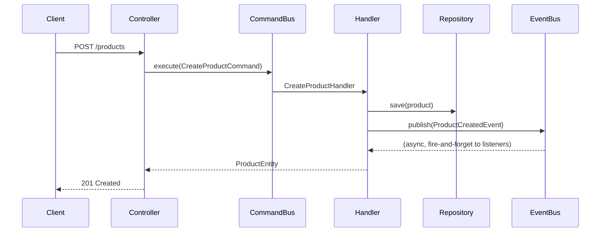
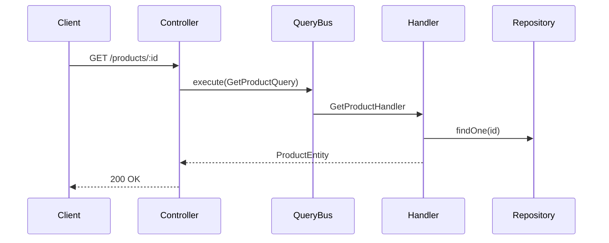

# nest-cqrs

A working NestJS reference template for **vertical slice architecture + CQRS**.
Clone it, run it, read three real slices instead of reading about the pattern.

## Why vertical slices

A traditional NestJS app is organized by *technical layer* — one `controllers/`
folder, one `services/` folder, one `entities/` folder — so a single feature's
code is scattered across the whole codebase. A **vertical slice** flips that:
each feature owns its full stack in one folder, and the folders only share a
`shared/` module for genuinely cross-cutting concerns (guards, interceptors,
decorators).

```
src/
├── category/     ← one feature = one folder = its own full stack
│   ├── api/               HTTP surface: controllers, DTOs
│   ├── application/       CQRS: commands, queries, their handlers
│   └── infrastructure/    persistence: TypeORM entities
├── product/
│   ├── api/
│   ├── application/
│   ├── domain/             events/   (published, not just declared)
│   └── infrastructure/
├── notification/
│   ├── api/                 a controller for a direct HTTP trigger
│   ├── application/
│   │   ├── commands/        SendNotificationCommand — manual send
│   │   ├── events/          ProductCreatedNotificationHandler — reacts to product/
│   │   └── interfaces/      INotificationService port + DI token
│   └── infrastructure/
│       └── services/        TelegramService — swappable concrete impl
└── shared/                 cross-cutting only: guards, decorators, entities
```

## Three slices, three lessons

| Slice | Shows |
|---|---|
| `category/` | The floor: plain CRUD. No `domain/` layer — there's no real business invariant to protect, so the handler just talks straight to `Repository<CategoryEntity>`. Full create/update/delete/get/list. |
| `product/` | Slices aren't sealed boxes. `create-product` validates `categoryId` against `category/`'s own entity, and `category/`'s delete handler checks `product/`'s entity before allowing a delete (`409` if in use). Also **publishes** `ProductCreatedEvent` via a plain `EventBus.publish()` call — no aggregate, no event-sourcing machinery, just a domain event. |
| `notification/` | Event-driven, and reachable two ways: `POST /notifications/send` triggers it directly; `ProductCreatedEvent` triggers it automatically via `@EventsHandler`. Both paths go through the same `INotificationService` interface — currently backed by `TelegramService`, swappable for any other provider (email, SMS...) without touching the handler. |

## Request lifecycle

**Command (write):**



**Query (read):**



Commands write, queries read — the two paths never mix. Controllers only
dispatch to a bus; no business logic lives in `api/`.

## Quickstart

```bash
cp .env.example .env      # defaults already match docker-compose
docker compose up -d      # postgres:16
npm install
npm run start:dev         # http://localhost:3000
```

```bash
npm run test               # unit tests
npm run test:e2e           # e2e tests (none yet — passes with 0)
npm run lint
```

## Endpoints

| Method | Path | |
|---|---|---|
| POST | `/categories` | create |
| GET | `/categories` | list |
| GET | `/categories/:id` | get one |
| PATCH | `/categories/:id` | update |
| DELETE | `/categories/:id` | delete (409 if a product references it) |
| POST | `/products` | create (400 if `categoryId` doesn't exist) |
| GET | `/products?categoryId=` | list, optionally filtered |
| GET | `/products/:id` | get one |
| POST | `/notifications/send` | manually trigger a notification |

## Adding your own slice

1. `src/<feature>/api/{controllers,dto}` — the HTTP surface
2. `src/<feature>/application/{commands,queries}` — one file per command/query, one per handler
3. `src/<feature>/infrastructure/entities` — the TypeORM entity
4. Only add `domain/` if there's a real invariant to protect or an event to publish — `category/` shows it's fine to skip
5. Register the entity in `src/typeorm.config.ts` and the module in `src/app.module.ts`

## Stack

NestJS 11 · `@nestjs/cqrs` · TypeORM · PostgreSQL · Jest

## License

MIT — see [LICENSE](./LICENSE).
